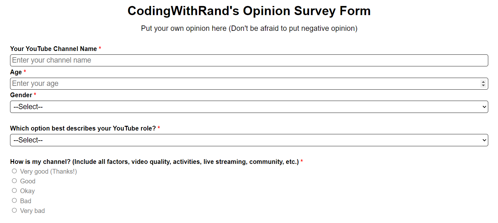
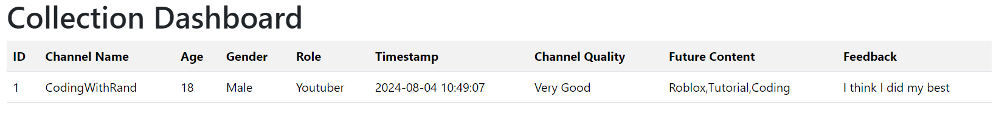

# Simple Survey Form
A simple survey form to collect opinion from subscribers and viewers on my YouTube channel. The data will be stored in a database, and can be displayed as a table in the admin panel **(User: CodingWithRand, Password: cwrcwrcwr)**. Developed in HTML, CSS, PHP and MySQL. You can visit [here](http://codingwithrand.infinityfreeapp.com/Inquiry/)

I previously hosted this website on [000webhost](https://000webhost.com) but the company had been shut down, so the website was archived. Unfortunately, I didn't notice this, and couldn't go back up the website on time, so the site was completely deleted. Therefore, I'll have to re-create the website once again and host it on [InfinityFree](https://infinityfree.com)

# Overview

Form page

 

Dashboard showing the data collect from user
