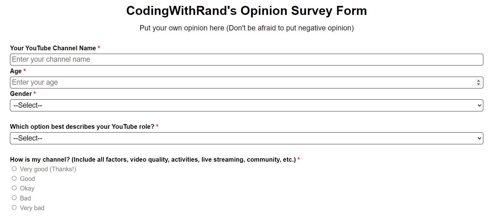
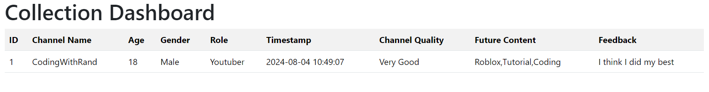

# Simple Survey Form
A simple survey form to collect opinion from subscribers and viewers on my YouTube channel. The data will be stored in a database, and can be displayed as a table in the admin panel **(User: CodingWithRand, Password: cwrcwrcwr)**. Developed in HTML, CSS, PHP and MySQL. You can visit [here](http://codingwithrand.infinityfreeapp.com/Inquiry/)
 
แบบสำรวจง่ายๆ เพื่อรวบรวมความคิดเห็นจากสมาชิกและผู้ชมช่อง YouTube ของผม ข้อมูลจะถูกเก็บไว้ในฐานข้อมูล และสามารถแสดงเป็นตารางในแผงควบคุมผู้ดูแลระบบ **(ผู้ใช้: CodingWithRand, รหัสผ่าน: cwrcwrcwr)** พัฒนาด้วย HTML, CSS, PHP และ MySQL คุณสามารถเข้าชมเว็บไซต์ได้[ที่นี่](http://codingwithrand.infinityfreeapp.com/Inquiry/)

I previously hosted this website on [000webhost](https://000webhost.com) but the company had been shut down. Unfortunately, I didn't notice this, and couldn't go back up the website on time, so the site was completely deleted. Therefore, I'll have to re-create the website once again and host it on [InfinityFree](https://infinityfree.com)
 
ก่อนหน้านี้ผมโฮสต์เว็บไซต์นี้บน [000webhost](https://000webhost.com) แต่บริษัทถูกปิดตัวลง ผมไม่รู้เรื่องนี้ ผมจึงและไม่สามารถกู้คืนเว็บไซต์ได้ทันเวลา ดังนั้นเว็บไซต์จึงถูกลบไปทั้งหมด ผมเลยสร้างเว็บไซต์ขึ้นมาใหม่แทนเว็บไซต์ที่ถูกลบไปและโฮสต์บน [InfinityFree](https://infinityfree.com)

# Overview

Form page
 
หน้าแบบสอบถาม

 

Dashboard showing the data collect from user
 
แดชบอร์ดแสดงข้อมูลที่รวบรวมจากผู้ใช้
